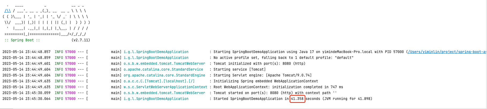
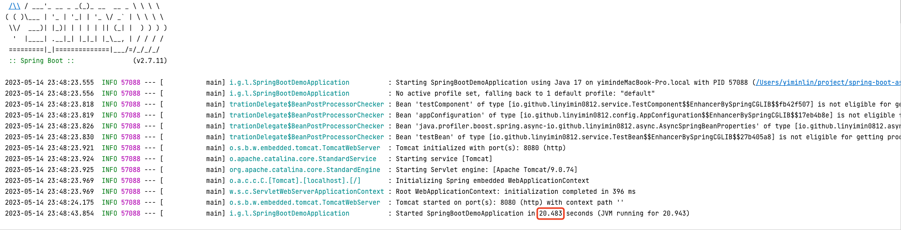

# 说明

本demo模拟了两个初始化耗时比较长(sleep 20秒)，分别测试不使用异步bean加载和使用异步bean加载下应用的启动时长

# 1. 正常启动(不使用异步bean加载)

启动时长为41s



# 2. 异步bean加载

1. 引入异步bean加载的starter包

```xml
<dependency>
    <groupId>io.github.linyimin0812</groupId>
    <artifactId>spring-async-bean-starter</artifactId>
    <version>1.1.2</version>
</dependency>
```

2. application.properties文件中配置异步加载的bean

```properties
java.profiler.boost.spring.async.asyncBeanPriorityLoadEnable=true
java.profiler.boost.spring.async.beanNames=testBean,testComponent
```

启动时长为20s

